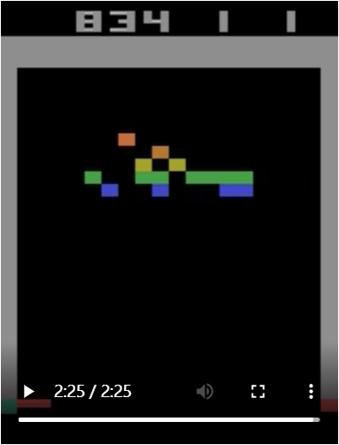
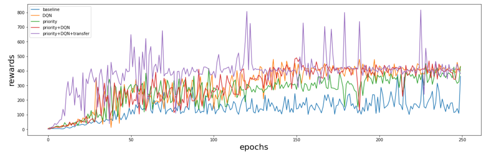

# breakout-drl
This repositories contains implementation Naive DQN, Dueling DQN, Prioritized Experience Replay for Atari-Breakout

We obatin our best score of 834 via PER+DDQN+Transfer Learning, and the corresponding weights is stored in best.weights. You can play with it in `./best.ipynb`




# Getting Started

You can install our environments with

```bash
pip install -r requirements.txt
```

Go into any directory you want to play with(e.g. `./per_ddqn_transfer`)

```bash
cd per_ddqn_transfer
```

And run

```bash
./run.sh
```

# Evaluating

You can certainly see how our model play the game in `best.ipynb`.

If you want to resume training, please follow this instruction.

1. Set a variable storing the path to the weights you want to load.(e.g. restore = './best.weights')
2. Set EPS_START and EPS_END to 0 in main.py.
3. Parse the path into $Agent.\_\_init\_\_()$, see utils_drl.py for more details.
4. run the run.sh script.